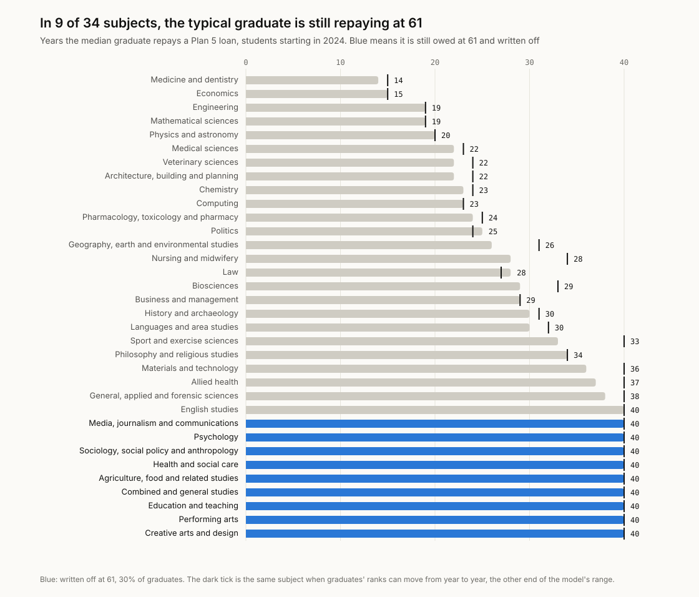
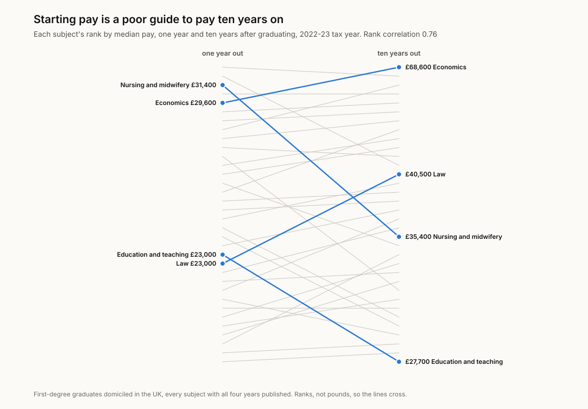
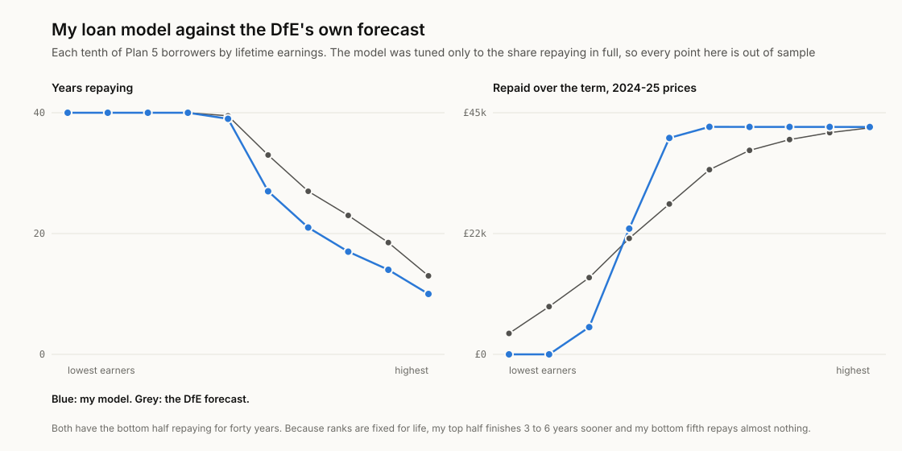

# degree-value

What a Plan 5 student loan actually costs, by subject, for students in England
starting from 2024. Built from what each subject's graduates really earned, the
DfE's Longitudinal Education Outcomes (LEO) data, and checked against the DfE's
own published figures and its own forecast of Plan 5 repayments.

**Pick your subject:** [finntech3.github.io/degree-value](https://finntech3.github.io/degree-value/)

## The finding

**In 10 of 34 subjects, the typical graduate is still repaying when the loan is
written off at 61.** Those subjects hold 34% of graduates. For their median
graduate, Plan 5 is not a loan that gets paid off. It is 9% of everything they
earn above the threshold, every year, for forty years.

At the other end, the median medicine graduate is done in 14 years and the
median economics graduate in 15, at 36.

<picture>
  <source media="(prefers-color-scheme: dark)" srcset="docs/figures/years-by-subject-dark.svg">
  
</picture>

| Subject | Clear it in full | Median graduate's years | Median graduate repays, 2024-25 prices |
|---|---:|---:|---:|
| Medicine and dentistry | 88% | 14 | £42,347 |
| Economics | 80% | 15 | £42,363 |
| Engineering | 79% | 19 | £42,362 |
| Law | 60% | 28 | £42,373 |
| Nursing and midwifery | 62% | 28 | £42,360 |
| Business and management | 58% | 29 | £42,370 |
| Psychology | 49% | 40, written off | £40,262 |
| Education and teaching | 40% | 40, written off | £25,585 |
| Performing arts | 38% | 40, written off | £23,824 |
| Creative arts and design | 38% | 40, written off | £20,793 |

The last column is the part people miss. The economics graduate who clears the
loan at 36 and the psychology graduate who is still repaying at 61 pay back
almost the same amount in today's money. The creative arts graduate pays about
half as much, over more than twice as long.

**What I think this means.** "Will I pay it off?" is the wrong question for most
students, and the amount borrowed matters much less than it looks. For the best
paid, Plan 5 is a loan with interest at RPI, cleared in their thirties. For a
third of graduates it is a tax on earnings above the threshold, and for them the
headline debt is almost irrelevant: an extra year of maintenance loan changes
the balance written off, not what they pay each month.

**Starting pay is a poor guide to any of this.** Nursing graduates out-earn
economists a year after graduating, £31,400 against £29,600. Ten years out the
economists earn £68,600 and the nurses £35,400. Nursing falls from 3rd of 34
subjects to 20th; law rises from 23rd to 13th. The rank correlation between
pay one year out and ten years out is 0.76, high but far from one.

<picture>
  <source media="(prefers-color-scheme: dark)" srcset="docs/figures/pay-ranks-dark.svg">
  
</picture>

**It is not mostly A-levels.** Among graduates who came in with the same A-level
points (300 to 359 UCAS points, better than three Bs), the spread in pay
between subjects five years out is only 8% narrower than among all graduates.
Whatever drives the gap between subjects, most of it is not the grades students
arrived with. That comparison only covers graduates whose tariff points were
recorded, which leaves out many mature and international students.

**Neither the table nor the tool is the value of a degree.** In 2024 the median
full-time graduate in England aged 16 to 64 earned £42,000 and the median
non-graduate £30,500. That gap mixes what a degree adds with who goes to university, and this
project makes no attempt to separate them. It measures what graduates of each
subject earn and what the loan then costs them, nothing more.

## Verify before you interpret

**The earnings.** The DfE publishes, for every university, the range of its
graduates' median pay and employment. I rebuilt those ranges from the DfE's raw
787 MB provider file:

| Check | Result | Its twin |
|---|---|---|
| Four published ranges across universities: pay for all graduates, men and women, and sustained work or study | all 8 numbers reproduced exactly | the percentile most software uses by default reproduces 6 of 8; limiting to English providers, or misreading a column, also fails |
| The national headline: median pay five years out, share in work or study, the gap between men's and women's pay | £31,400, 88.6%, 12.8%, all exact | measuring the pay gap as a share of women's pay gives 14.7% |

Two details only came out because the check had to match exactly. The DfE's
ranges use the simplest definition of a percentile (the observation at the
rank, Hyndman and Fan's type 1), not the interpolated one that spreadsheets and
most libraries use by default. And its pay gap is measured as a share of men's
pay.

**The loan model.** The DfE forecasts Plan 5 repayments with its own
microsimulation and publishes the results. I set up my model from public inputs
and tuned exactly one number: pay growth after 2030, when the OBR's forecast
ends. Set to RPI plus 0.30% a year, the model has 55.6% of borrowers clearing
the loan, against the DfE's 56%. Everything below it was not tuned:

| | My model | DfE forecast |
|---|---:|---:|
| Median years repaying | 32 | 31.5 |
| Lifetime repayments, 2024-25 prices | £28,055 | £29,500 |
| Share of the balance repaid | 68.9% | 72% |
| Bottom half of earners | repay for the full 40 years | repay for the full 40 years |

<picture>
  <source media="(prefers-color-scheme: dark)" srcset="docs/figures/model-check-dark.svg">
  
</picture>

It misses in two ways, and I would rather say so than hide them. It collects
about 5% less than the DfE over the term. And it is too polarised: the best-paid
half finishes three to six years sooner than the DfE expects, and the bottom
fifth repays almost nothing where the DfE expects a few thousand pounds. Both
come from the same simplification. Each graduate keeps the same place among
their subject's graduates for life, so nobody has a good decade after a poor
one. The tests pin both gaps, so a change that moved either would have to be
written up.

Letting places move from year to year (each year's place correlated 0.9 with
the last) fixes the bottom and overshoots the total: lifetime repayments rise
to £32,693, 11% above the DfE. No single setting matches everything, so the
central results keep places fixed and the figure above marks where each subject
lands with places moving. Most subjects move by two years or less. Sport and
exercise sciences (33 to 40 years), nursing (28 to 34) and geography (26 to 31)
move most.

## How it works

- **Earnings to ten years.** LEO gives each subject's lower quartile, median and
  upper quartile of pay one, three, five and ten years after graduating, all in
  the 2022-23 tax year. Between those years pay follows a straight line in logs;
  within a year, graduates are spread along a log-normal through the quartiles.
  Graduates below the share not in sustained work or study five years out are
  given no earnings.
- **After ten years.** Pay follows the ONS's 2025 profile of median pay by age
  (ASHE table 6.7a): a little more growth into the forties, then a decline.
- **Money.** Pay moves from 2022-23 to each future year with the ONS's average
  weekly earnings to mid-2026, the OBR's forecast to 2030, and RPI plus the
  tuned 0.30% after. The threshold is £25,000 to 2026-27, then the DfE's
  published £25,925, £26,729 and £27,505, then RPI. Interest is RPI. Everything
  is held in whole pence.
- **The loan.** The DfE's average balance for full-time borrowers when
  repayment starts in April 2028, £47,900, repaid at 9% above the threshold
  until it is cleared or written off after 40 years. Real values are in 2024-25
  prices, starting from the DfE's own ratio of real to nominal balance.
- **Each subject.** Because places are fixed, a graduate's whole loan follows
  from where they land among their subject's graduates. The median graduate's
  loan and the share who clear it are therefore exact, not simulated, and they
  are what the tool's slider shows at its middle.

More on each choice in [docs/DESIGN-DECISIONS.md](docs/DESIGN-DECISIONS.md).
Every source, address and checksum is in [docs/SOURCES.md](docs/SOURCES.md).

## What this leaves out

- **Cause.** This says what graduates of each subject earned, not what the
  same people would have earned studying something else, or not studying.
- **The future.** Pay ten years out is from people who graduated around 2012.
  Everything after that is a projection along today's age profile.
- **Balances.** Everyone starts from the DfE's average balance. Longer courses
  and bigger maintenance loans mean bigger balances, which change the years for
  those who clear it and the amount written off for those who do not.
- **Career breaks and part-time work.** They are in LEO's pay figures as they
  happened to past graduates, but no individual path here has one.
- **Small groups.** The DfE suppresses small groups. A university without a
  published figure is not a university without graduates.

## What I got wrong first

- **Repayments were in the wrong year's prices.** I deflated the balance from
  2028 to 2024-25 prices with four years of inflation but each repayment with
  one fewer year's worth, which overstated the real share repaid by about 6%.
  The model looked like a near-perfect match at 73% against the DfE's 72%.
  Using the DfE's own real and nominal balances moved it to 69%, a real gap,
  now stated rather than hidden.
- **I used the OBR's long-run pay growth first.** With it, two thirds of
  graduates cleared their loans, far above the DfE's 56%. Matching the DfE
  needs pay after 2030 growing only 0.3% a year faster than RPI.
- **The tool and the table disagreed.** The subject figures came from a
  simulation of women and men, while the slider used each subject's
  all-graduates earnings, so the tool could show 13 years for the middle
  economics graduate beside a table saying 15. Both now come from the
  all-graduates earnings, exactly. That moved the count of subjects whose
  median graduate is written off from 12 to 10.
- **I miscounted my own check.** The range check's summary counted matching
  ranges twice, so the default percentile appeared to reproduce 4 of the 8
  numbers. It reproduces 6. The pass rule was never affected.

## Running it

Python 3.11 or later, standard library only.

```sh
python -m pip install pytest
PYTHONPATH=pipeline/src python -m degreevalue.report   # every number above
python -m pytest pipeline/tests                        # checks, twins, the loan model
python scripts/make_figures.py                         # redraw docs/figures
PYTHONPATH=pipeline/src python -m degreevalue.build    # the app's data
```

The full run, including tuning the loan model twice, takes about a minute and a
half. The DfE's raw files are too large to commit; `scripts/extract_leo.py` and
`scripts/extract_paths.py` rebuild the committed extracts from a fresh
download.

The app, in `web/`, needs Node 22:

```sh
cd web
npm ci
npm test
npm run dev
```

## License

MIT for the code. The data belongs to its publishers and is used under the Open
Government Licence v3.0.
